ME 317: Statistical Methods in Risk Management at LSE
================
Andrea Ranzato;
August 1st, 2019

## Summary

The general purpose of this project is to use techniques learned during
the course in *Statistical methods in risk management* useful to analyze
stock price data. In particular, we consider prices concerning ten
different stocks recorded during the 2007-2009 financial crisis. The
data source is the *Wharton Research Data Services*.

The analysis is structured as follows. In the first section, I show how
two extreme events, the rescue of Bear Sterns on March 14, 2008 and
Lehman Brothers bankruptcy on September 15, 2008, affected the price and
log-return dynamics. Next, I test both the marginal and joint normality
of the ten stock returns by means of the *Jarque-Bera* and *Mardia test*
respectively. First, we observe that the normal distribution fails to
capture returns happening in the tails. Second, joint normality is not
detected. Subsequently, I evaluate some pair-wise stock returns, either
from companies of the same sector and different ones, in order to
quantify their correlation.

In the second section, I focus on financial stocks with the objective of
assessing their dependence using copulas of different types. We see,
that the copula which fits the observations best is the t-Copula.

In the third section, I consider a linear portfolio which invest $1000
in each of the stocks at the beginning of the period, assuming that its
composition does not change during the entire period. Afterwards, I
evaluate the Value-at-Risk of the portfolio at 95% level using two
different strategies. Firstly, I compute the VaR using the empirical
profit and loss distribution, secondly using a normal model. The
comparison between the two shows that the parametric approach would have
led to more conservative capital management decisions compared to
empirical one, since it signals higher potential losses. In the end, I
add to the analysis 2010 portfolio returns, in order to record the
number of violations occurred under the two different frameworks. We see
that the normal model incurs in fewer violations with respect to the the
historical one.

The last section is devoted to the description of the topics covered
during the course.

## Prices and log returns dynamics

The purpose of this section consists in showing some empirical
properties of financial time series using a sample of US assets. First
of all, I conduct an exploratory analysis of the price dynamics of
equities in the Table below between 3 January 2007 and 31 December 2009.
As we can see in the Figure below, a strong negative trend plays out in
correspondence with Bear Stearns rescue on March 14 2008 and terminates
around January 20 2009. The Table below, quantifies the percentage price
change recorded in that period summarizing the worst downturn of the US
financial system since the Great Depression.

| Company                      | Sector     | Ticker |
| :--------------------------- | :--------- | :----- |
| American International Group | Financials | AIG    |
| Amazon.com, Inc.             | Consumer   | AMZN   |
| Bank of America Corp.        | Financials | BA     |
| Goldman Sachs Group, Inc.    | Financials | GS     |
| Coca-Cola Company            | Consumer   | KO     |
| Morgan Stanley               | Financials | MS     |
| Microsoft Corp.              | IT         | MSFT   |
| Northern Trust Corp.         | Financials | NTRS   |
| Wells Fargo & Co             | Financials | WFC    |
| ExxonMobil Corp.             | Energy     | XOM    |

Table: Equity portfolio composition.

| Ticker | Sector    | P.2008-03-14 | P.2009-01-20 | (%) Change |
| :----- | :-------- | -----------: | -----------: | ---------: |
| MSFT   | IT        |        27.96 |        18.48 | \-33.90558 |
| KO     | Consumer  |        57.53 |        42.88 | \-25.46497 |
| XOM    | Energy    |        85.91 |        76.29 | \-11.19777 |
| BA     | Financial |        76.23 |        40.36 | \-47.05497 |
| WFC    | Financial |        28.45 |        14.23 | \-49.98243 |
| NTRS   | Financial |        66.08 |        43.93 | \-33.51998 |
| AIG    | Financial |        41.18 |         1.37 | \-96.67314 |
| MS     | Financial |        39.55 |        13.10 | \-66.87737 |
| AMZN   | Consumer  |        68.22 |        48.44 | \-28.99443 |
| GS     | Financial |       156.86 |        59.20 | \-62.25934 |

Table: Percentage price change between 14 Mar. 2008 and 20 Jan. 2009

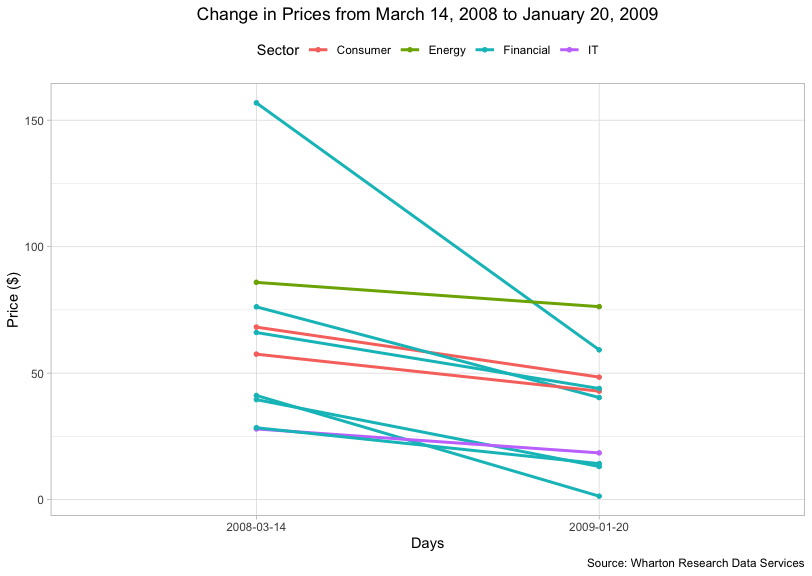

Then, I consider the log returns illustrated in the Figure below where
we can realize the presence of the following *stylized facts*, as
reported in Embrechts, McNeil, and Frey (2015). (1) conditional expected
returns are close to zero; (2) volatility appears to vary over; (3)
extreme returns appear in clusters. In particular, within our context,
higher volatility is registered afterwards the bankruptcy of Lehman
Brothers highlighted in red.

We model log-returns instead of plain prices, in order to accommodate
the assumptions underlying the lognormal model, namely that, following
the formulation of Ruppert (2006), ,\\ r_{2} = log(1 + R_{2}), \\ldots,\\ r_{n} = log(1 + R_{n})")
are i.i.d.
"), where , for
.

Using this model allows easier computations of multiperiod returns since

  
  = (1 + {R}_{t}) \\cdots (1 + {R}_{t-k+1})\\\\
=  exp(r_{t}) \\cdots exp(r_{t-k+1})\\\\
=  exp(r_{t} + \\ldots + r_{t-k+1})
")  
where
") indicates the gross return over the most recent k periods.

As a result,

  
)=r_{t} + \\cdots + r_{t-k+1}")  

Hence, since each
 is
normal, their sum is normal too.

Moreover, log returns represent a close approximation of the net returns
, unless  is small.

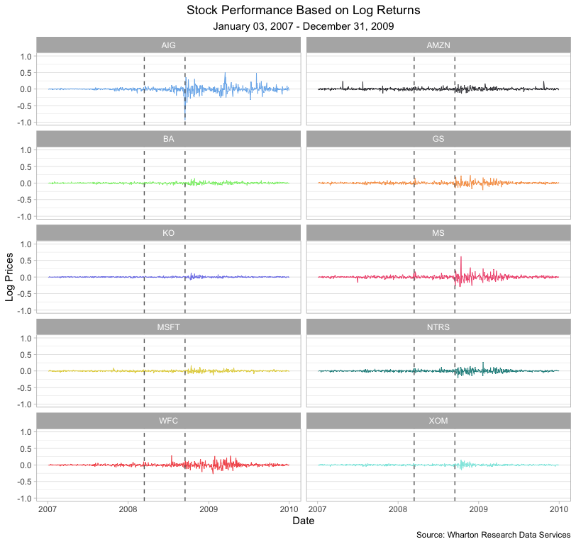

The exploratory analysis follows by testing both marginal and *joint*
normality of the log returns. First, the nonnnormality of the marginal
distribution is assessed by looking at the *QQ Plots* which compares
theoretical quantiles one would observe in case of normality, with those
of the actual sample observations. In all cases, we observe that the
normal model provide a faithful description of the returns only with
respect to observations close to mean. Instead, observations far away
from the mean, the so-called *tails*, are under-represented since the
normal model does not set enough probability mass on observations away

from the mean. The results from *Jarque-Bera* test in the Table below
aids the naked eye to confirm the initial beliefs by rejecting the null
hypothesis of normality. In addition, I provide the Skewness and
Kurtosis Measurements to reinforce the idea that the marginal empirical
distributions are not normal. In general, distributions with higher
kurtosis and *fat-tails* might provide a better representation of the
returns.

| TICKER |    statistic | p.value | Normal |
| :----- | -----------: | ------: | :----- |
| BA     |       441,26 |       0 | No     |
| MSFT   |     1.457,46 |       0 | No     |
| GS     |     1.927,01 |       0 | No     |
| WFC    |     1.971,43 |       0 | No     |
| NTRS   |     2.104,45 |       0 | No     |
| AMZN   |     2.531,43 |       0 | No     |
| XOM    |     3.295,95 |       0 | No     |
| KO     |     3.459,27 |       0 | No     |
| MS     |    20.343,61 |       0 | No     |
| AIG    | 2.102.833,21 |       0 | No     |

Table: Jarque Bera Test, n. obs. = 756

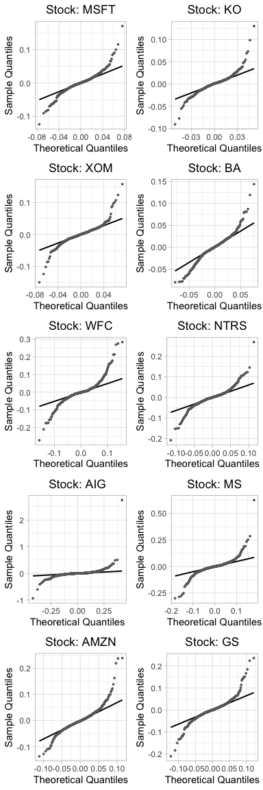

| Ticker | Statistic | p-value | Alternative | t-Student |
| :----- | --------: | ------: | :---------- | :-------- |
| AIG    |    0,4170 |       0 | two-sided   | NO        |
| WFC    |    0,4389 |       0 | two-sided   | NO        |
| MS     |    0,4392 |       0 | two-sided   | NO        |
| NTRS   |    0,4503 |       0 | two-sided   | NO        |
| GS     |    0,4518 |       0 | two-sided   | NO        |
| AMZN   |    0,4556 |       0 | two-sided   | NO        |
| MSFT   |    0,4664 |       0 | two-sided   | NO        |
| BA     |    0,4687 |       0 | two-sided   | NO        |
| XOM    |    0,4688 |       0 | two-sided   | NO        |
| KO     |    0,4769 |       0 | two-sided   | NO        |

Table: One-sample Kolmogorov-Smirnov test for student-t distribution,
n. obs. = 756, dgf. = 10

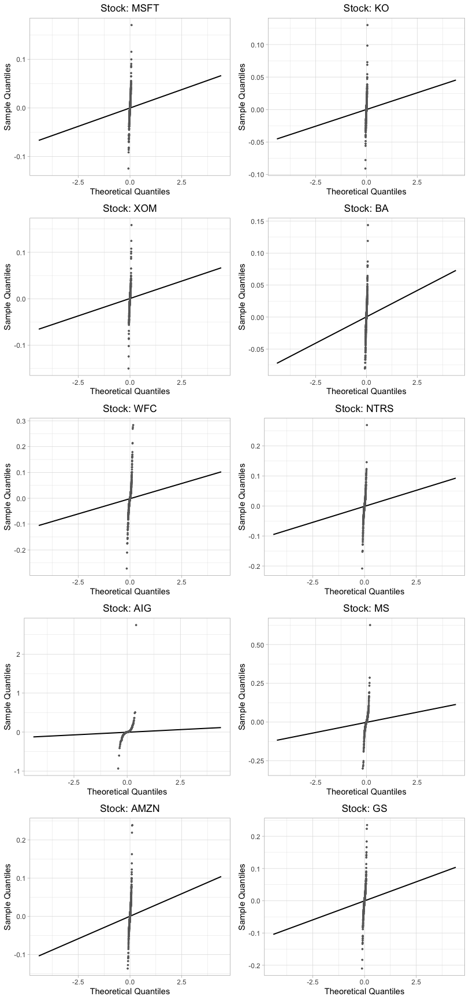

From a practical point of view, these results questions the reliability
of the Normal Value-at-Risk model to identify extreme negative returns.

<table>

<caption>

Table: Log Returns Skewness and Kurtosis, n. obs. = 756

</caption>

<thead>

<tr>

<th style="text-align:left;">

</th>

<th style="text-align:right;">

Skewness

</th>

<th style="text-align:right;">

Kurtosis

</th>

</tr>

</thead>

<tbody>

<tr>

<td style="text-align:left;">

BA

</td>

<td style="text-align:right;">

0,25

</td>

<td style="text-align:right;">

3,69

</td>

</tr>

<tr>

<td style="text-align:left;">

MSFT

</td>

<td style="text-align:right;">

0,35

</td>

<td style="text-align:right;">

6,74

</td>

</tr>

<tr>

<td style="text-align:left;">

GS

</td>

<td style="text-align:right;">

0,43

</td>

<td style="text-align:right;">

7,75

</td>

</tr>

<tr>

<td style="text-align:left;">

WFC

</td>

<td style="text-align:right;">

0,67

</td>

<td style="text-align:right;">

7,77

</td>

</tr>

<tr>

<td style="text-align:left;">

NTRS

</td>

<td style="text-align:right;">

0,18

</td>

<td style="text-align:right;">

8,14

</td>

</tr>

<tr>

<td style="text-align:left;">

AMZN

</td>

<td style="text-align:right;">

1,21

</td>

<td style="text-align:right;">

8,61

</td>

</tr>

<tr>

<td style="text-align:left;">

XOM

</td>

<td style="text-align:right;">

0,14

</td>

<td style="text-align:right;">

10,20

</td>

</tr>

<tr>

<td style="text-align:left;">

KO

</td>

<td style="text-align:right;">

0,75

</td>

<td style="text-align:right;">

10,34

</td>

</tr>

<tr>

<td style="text-align:left;">

MS

</td>

<td style="text-align:right;">

1,40

</td>

<td style="text-align:right;">

25,20

</td>

</tr>

<tr>

<td style="text-align:left;">

AIG

</td>

<td style="text-align:right;">

11,64

</td>

<td style="text-align:right;">

256,80

</td>

</tr>

</tbody>

</table>

Since most of the times the interest is devoted in understanding the
behaviour of returns considered simultaneously rather than individually,
we test also the normality of the ten-dimensional random vector
"). The test chosen to assess
multivariate joint normality is the *Mardia test* which compares
multivariate measures of skewness and kurtosis on the basis of the
*Mahalanobis distance*. The results in the Table and Figure below
suggest strong evidence against the non-normality hypothesis.

<table>

<caption>

Table: Mardia test for Multivariate Normality.

</caption>

<thead>

<tr>

<th style="text-align:left;">

Test

</th>

<th style="text-align:right;">

Statistic

</th>

<th style="text-align:left;">

p value

</th>

<th style="text-align:left;">

Result

</th>

</tr>

</thead>

<tbody>

<tr>

<td style="text-align:left;">

Mardia Skewness

</td>

<td style="text-align:right;">

28.530,781

</td>

<td style="text-align:left;">

0

</td>

<td style="text-align:left;">

NO

</td>

</tr>

<tr>

<td style="text-align:left;">

Mardia Kurtosis

</td>

<td style="text-align:right;">

462,258

</td>

<td style="text-align:left;">

0

</td>

<td style="text-align:left;">

NO

</td>

</tr>

</tbody>

</table>

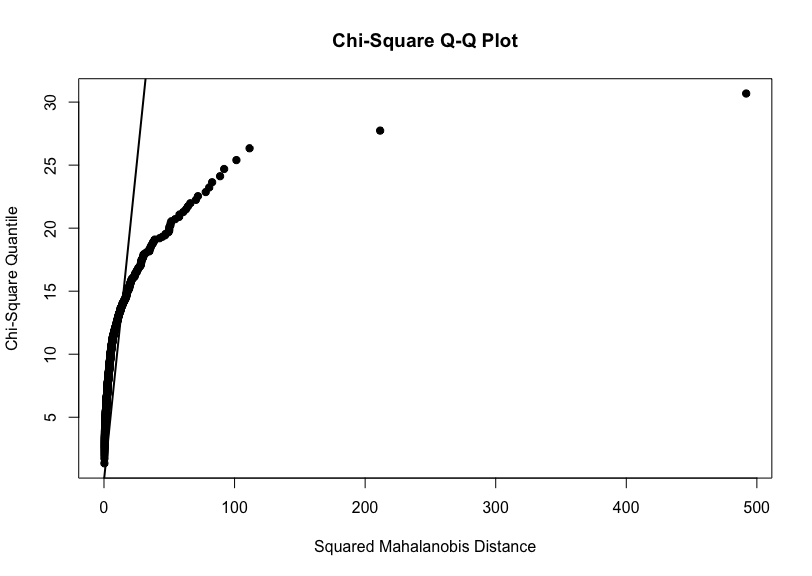

In this section, we have become aware that risk models based on the
normal distribution are not satisfactory since they might underestimate
the risk of suffering large losses. Embrechts, McNeil, and Frey (2015)
summarizes the following pitfalls:

  - The tails of its univariate marginal distributions are too thin;
    they do not assign enough weight to *extreme* events.

  - The joint tails of the distribution do not assign enough weight to
    *joint extreme* outcomes.

  - The distribution has a strong form of symmetry, known as elliptical
    asymmetry.

## Copulas

In this section, I begin with considering pair-wise returns of stocks
belonging to the financial sector, in order to investigate their
dependence structure. The Figure below represent the empirical marginal
distribution, as well as pairs of scatterplots between returns. In
addition, the upper off-diagonal quadrants provides a measure of linear
correlation between stocks. We can see that there exists a decent amount
of linear correlation between pairs stocks. However, we know that this
measure is reliable only when the underlying data generating mechanism
is ascribable to an elliptical distribution such as the multivariate
Normal. For this reason, we assess visually if the data presents the
features of elliptical distributions. Instead, we spot within our data:
(1) the presence of deviations from ellipsoids of constant density; (2)
some *long tails*, especially between GS and MS; (3) potential presence
of non linear behaviours; (4) high kurtosis of the marginals. These
feelings are confirmed by the Mardia test on all the combinations of
financials stocks which confirms that bivariate distributions between
stocks are not Normal.

As a consequence, the Pearson correlation coefficient is a good measure
of association, only when the returns have an elliptical distribution,
because it does not takes into account non linearities which might be
well present in empirical data. If this is not the case, we should rely
on concordance measure such as the *Spearman’s rank correlation* and
*Kendall’s Tau*. For example, given two bivariate distributions, one
with stronger lower tail dependence than the other, it might happen that
the correlation coefficient is the same, even if one of the two should
be perceived as more riskier than the other. Hence, once again, assuming
i.i.d. returns from elliptical distributions in the construction of risk
models, and relying on their measure of linear correlation, might not
represent a reliable representation of the phenomenon. For this reason,
we need risk measures able to provide a description of the returns which
go beyond the description “when the returns of stock A fall, returns of
stock B fall too”. Having statistical tools able to account for these
behaviours is relevant for risk management purposes.

Copulas are joint distributions defined on the hyper-unit cube with the
following characteristics:

  - Provide way of isolating the description of the dependence
    structure.
  - Express dependence on a *quantile scale*.
  - Facilitate a bottom-up approach to multivariate model building.

As any other joint distributions copulas have density function and
cumulative distribution function. Generally speaking, copulas are fitted
to the data as follows: firstly, the so called margins (i.e. the stand
alone marginal distributions) are specified, namely they are known
distributions. If this is the case, we proceed by estimating the
parameters of interest from empirical data using MLE. Then, we apply the
corresponding probability integral transform to each margin to obtain
Uniforms margins. This is possible since the parameters and the inverse
function are known. Finally, we estimate the copula density with MLE.

However, in practice, the margins are unknown. As a consequence, the
margins are estimated non-parametrically, by means of the empirical
distribution function. This is done in order to recover a sample of
*pseudo-observations* with uniform distributed margins where the copulas
densities are fitted. The table below reports the output of the maximum
likelihood regarding four different types of multivariate copulas fitted
on the financials stocks. Student-t coupla fits the data better compared
to the others.

<table>

<caption>

Table: MLE results of four different multivariate copula of the
Financial stocks

</caption>

<thead>

<tr>

<th style="text-align:right;">

Normal

</th>

<th style="text-align:right;">

Student

</th>

<th style="text-align:right;">

Gumbel

</th>

<th style="text-align:right;">

Clayton

</th>

</tr>

</thead>

<tbody>

<tr>

<td style="text-align:right;">

1.256,09

</td>

<td style="text-align:right;">

1.667,14

</td>

<td style="text-align:right;">

944,6

</td>

<td style="text-align:right;">

944,6

</td>

</tr>

</tbody>

</table>

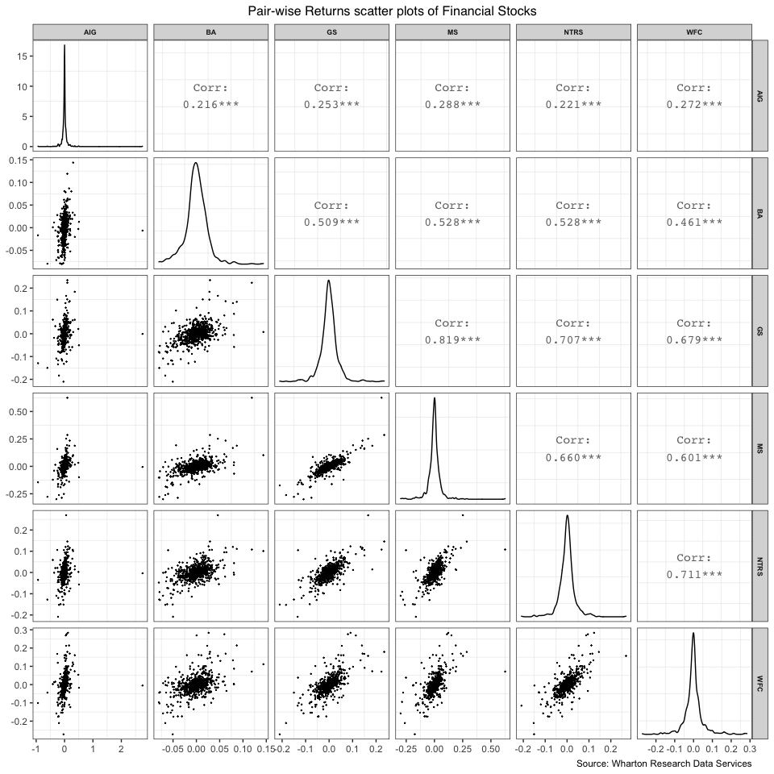

<table class="kable_wrapper">

<tbody>

<tr>

<td>

<table>

<caption>

Normality test between: BA-WFC

</caption>

<thead>

<tr>

<th style="text-align:left;">

Test

</th>

<th style="text-align:right;">

Statistic

</th>

<th style="text-align:right;">

P.value

</th>

<th style="text-align:left;">

Result

</th>

</tr>

</thead>

<tbody>

<tr>

<td style="text-align:left;">

Mardia Skewness

</td>

<td style="text-align:right;">

105,76

</td>

<td style="text-align:right;">

0

</td>

<td style="text-align:left;">

NO

</td>

</tr>

<tr>

<td style="text-align:left;">

Mardia Kurtosis

</td>

<td style="text-align:right;">

44,62

</td>

<td style="text-align:right;">

0

</td>

<td style="text-align:left;">

NO

</td>

</tr>

</tbody>

</table>

</td>

<td>

<table>

<caption>

Normality test between: BA-NTRS

</caption>

<thead>

<tr>

<th style="text-align:left;">

Test

</th>

<th style="text-align:right;">

Statistic

</th>

<th style="text-align:right;">

P.value

</th>

<th style="text-align:left;">

Result

</th>

</tr>

</thead>

<tbody>

<tr>

<td style="text-align:left;">

Mardia Skewness

</td>

<td style="text-align:right;">

47,25

</td>

<td style="text-align:right;">

0

</td>

<td style="text-align:left;">

NO

</td>

</tr>

<tr>

<td style="text-align:left;">

Mardia Kurtosis

</td>

<td style="text-align:right;">

48,27

</td>

<td style="text-align:right;">

0

</td>

<td style="text-align:left;">

NO

</td>

</tr>

</tbody>

</table>

</td>

<td>

<table>

<caption>

Normality test between: BA-AIG

</caption>

<thead>

<tr>

<th style="text-align:left;">

Test

</th>

<th style="text-align:right;">

Statistic

</th>

<th style="text-align:right;">

P.value

</th>

<th style="text-align:left;">

Result

</th>

</tr>

</thead>

<tbody>

<tr>

<td style="text-align:left;">

Mardia Skewness

</td>

<td style="text-align:right;">

20.346,53

</td>

<td style="text-align:right;">

0

</td>

<td style="text-align:left;">

NO

</td>

</tr>

<tr>

<td style="text-align:left;">

Mardia Kurtosis

</td>

<td style="text-align:right;">

991,90

</td>

<td style="text-align:right;">

0

</td>

<td style="text-align:left;">

NO

</td>

</tr>

</tbody>

</table>

</td>

<td>

<table>

<caption>

Normality test between: BA-MS

</caption>

<thead>

<tr>

<th style="text-align:left;">

Test

</th>

<th style="text-align:right;">

Statistic

</th>

<th style="text-align:right;">

P.value

</th>

<th style="text-align:left;">

Result

</th>

</tr>

</thead>

<tbody>

<tr>

<td style="text-align:left;">

Mardia Skewness

</td>

<td style="text-align:right;">

305,84

</td>

<td style="text-align:right;">

0

</td>

<td style="text-align:left;">

NO

</td>

</tr>

<tr>

<td style="text-align:left;">

Mardia Kurtosis

</td>

<td style="text-align:right;">

103,65

</td>

<td style="text-align:right;">

0

</td>

<td style="text-align:left;">

NO

</td>

</tr>

</tbody>

</table>

</td>

<td>

<table>

<caption>

Normality test between: BA-GS

</caption>

<thead>

<tr>

<th style="text-align:left;">

Test

</th>

<th style="text-align:right;">

Statistic

</th>

<th style="text-align:right;">

P.value

</th>

<th style="text-align:left;">

Result

</th>

</tr>

</thead>

<tbody>

<tr>

<td style="text-align:left;">

Mardia Skewness

</td>

<td style="text-align:right;">

62,90

</td>

<td style="text-align:right;">

0

</td>

<td style="text-align:left;">

NO

</td>

</tr>

<tr>

<td style="text-align:left;">

Mardia Kurtosis

</td>

<td style="text-align:right;">

48,98

</td>

<td style="text-align:right;">

0

</td>

<td style="text-align:left;">

NO

</td>

</tr>

</tbody>

</table>

</td>

<td>

<table>

<caption>

Normality test between: WFC-NTRS

</caption>

<thead>

<tr>

<th style="text-align:left;">

Test

</th>

<th style="text-align:right;">

Statistic

</th>

<th style="text-align:right;">

P.value

</th>

<th style="text-align:left;">

Result

</th>

</tr>

</thead>

<tbody>

<tr>

<td style="text-align:left;">

Mardia Skewness

</td>

<td style="text-align:right;">

95,44

</td>

<td style="text-align:right;">

0

</td>

<td style="text-align:left;">

NO

</td>

</tr>

<tr>

<td style="text-align:left;">

Mardia Kurtosis

</td>

<td style="text-align:right;">

76,17

</td>

<td style="text-align:right;">

0

</td>

<td style="text-align:left;">

NO

</td>

</tr>

</tbody>

</table>

</td>

<td>

<table>

<caption>

Normality test between: WFC-AIG

</caption>

<thead>

<tr>

<th style="text-align:left;">

Test

</th>

<th style="text-align:right;">

Statistic

</th>

<th style="text-align:right;">

P.value

</th>

<th style="text-align:left;">

Result

</th>

</tr>

</thead>

<tbody>

<tr>

<td style="text-align:left;">

Mardia Skewness

</td>

<td style="text-align:right;">

22.091,12

</td>

<td style="text-align:right;">

0

</td>

<td style="text-align:left;">

NO

</td>

</tr>

<tr>

<td style="text-align:left;">

Mardia Kurtosis

</td>

<td style="text-align:right;">

1.060,78

</td>

<td style="text-align:right;">

0

</td>

<td style="text-align:left;">

NO

</td>

</tr>

</tbody>

</table>

</td>

<td>

<table>

<caption>

Normality test between: WFC-MS

</caption>

<thead>

<tr>

<th style="text-align:left;">

Test

</th>

<th style="text-align:right;">

Statistic

</th>

<th style="text-align:right;">

P.value

</th>

<th style="text-align:left;">

Result

</th>

</tr>

</thead>

<tbody>

<tr>

<td style="text-align:left;">

Mardia Skewness

</td>

<td style="text-align:right;">

566,85

</td>

<td style="text-align:right;">

0

</td>

<td style="text-align:left;">

NO

</td>

</tr>

<tr>

<td style="text-align:left;">

Mardia Kurtosis

</td>

<td style="text-align:right;">

180,16

</td>

<td style="text-align:right;">

0

</td>

<td style="text-align:left;">

NO

</td>

</tr>

</tbody>

</table>

</td>

<td>

<table>

<caption>

Normality test between: WFC-GS

</caption>

<thead>

<tr>

<th style="text-align:left;">

Test

</th>

<th style="text-align:right;">

Statistic

</th>

<th style="text-align:right;">

P.value

</th>

<th style="text-align:left;">

Result

</th>

</tr>

</thead>

<tbody>

<tr>

<td style="text-align:left;">

Mardia Skewness

</td>

<td style="text-align:right;">

133,46

</td>

<td style="text-align:right;">

0

</td>

<td style="text-align:left;">

NO

</td>

</tr>

<tr>

<td style="text-align:left;">

Mardia Kurtosis

</td>

<td style="text-align:right;">

68,20

</td>

<td style="text-align:right;">

0

</td>

<td style="text-align:left;">

NO

</td>

</tr>

</tbody>

</table>

</td>

<td>

<table>

<caption>

Normality test between: NTRS-AIG

</caption>

<thead>

<tr>

<th style="text-align:left;">

Test

</th>

<th style="text-align:right;">

Statistic

</th>

<th style="text-align:right;">

P.value

</th>

<th style="text-align:left;">

Result

</th>

</tr>

</thead>

<tbody>

<tr>

<td style="text-align:left;">

Mardia Skewness

</td>

<td style="text-align:right;">

20.380,86

</td>

<td style="text-align:right;">

0

</td>

<td style="text-align:left;">

NO

</td>

</tr>

<tr>

<td style="text-align:left;">

Mardia Kurtosis

</td>

<td style="text-align:right;">

1.008,30

</td>

<td style="text-align:right;">

0

</td>

<td style="text-align:left;">

NO

</td>

</tr>

</tbody>

</table>

</td>

<td>

<table>

<caption>

Normality test between: NTRS-MS

</caption>

<thead>

<tr>

<th style="text-align:left;">

Test

</th>

<th style="text-align:right;">

Statistic

</th>

<th style="text-align:right;">

P.value

</th>

<th style="text-align:left;">

Result

</th>

</tr>

</thead>

<tbody>

<tr>

<td style="text-align:left;">

Mardia Skewness

</td>

<td style="text-align:right;">

396,38

</td>

<td style="text-align:right;">

0

</td>

<td style="text-align:left;">

NO

</td>

</tr>

<tr>

<td style="text-align:left;">

Mardia Kurtosis

</td>

<td style="text-align:right;">

181,75

</td>

<td style="text-align:right;">

0

</td>

<td style="text-align:left;">

NO

</td>

</tr>

</tbody>

</table>

</td>

<td>

<table>

<caption>

Normality test between: NTRS-GS

</caption>

<thead>

<tr>

<th style="text-align:left;">

Test

</th>

<th style="text-align:right;">

Statistic

</th>

<th style="text-align:right;">

P.value

</th>

<th style="text-align:left;">

Result

</th>

</tr>

</thead>

<tbody>

<tr>

<td style="text-align:left;">

Mardia Skewness

</td>

<td style="text-align:right;">

59,37

</td>

<td style="text-align:right;">

0

</td>

<td style="text-align:left;">

NO

</td>

</tr>

<tr>

<td style="text-align:left;">

Mardia Kurtosis

</td>

<td style="text-align:right;">

80,46

</td>

<td style="text-align:right;">

0

</td>

<td style="text-align:left;">

NO

</td>

</tr>

</tbody>

</table>

</td>

<td>

<table>

<caption>

Normality test between: AIG-MS

</caption>

<thead>

<tr>

<th style="text-align:left;">

Test

</th>

<th style="text-align:right;">

Statistic

</th>

<th style="text-align:right;">

P.value

</th>

<th style="text-align:left;">

Result

</th>

</tr>

</thead>

<tbody>

<tr>

<td style="text-align:left;">

Mardia Skewness

</td>

<td style="text-align:right;">

23.664,08

</td>

<td style="text-align:right;">

0

</td>

<td style="text-align:left;">

NO

</td>

</tr>

<tr>

<td style="text-align:left;">

Mardia Kurtosis

</td>

<td style="text-align:right;">

1.147,44

</td>

<td style="text-align:right;">

0

</td>

<td style="text-align:left;">

NO

</td>

</tr>

</tbody>

</table>

</td>

<td>

<table>

<caption>

Normality test between: AIG-GS

</caption>

<thead>

<tr>

<th style="text-align:left;">

Test

</th>

<th style="text-align:right;">

Statistic

</th>

<th style="text-align:right;">

P.value

</th>

<th style="text-align:left;">

Result

</th>

</tr>

</thead>

<tbody>

<tr>

<td style="text-align:left;">

Mardia Skewness

</td>

<td style="text-align:right;">

21.703,57

</td>

<td style="text-align:right;">

0

</td>

<td style="text-align:left;">

NO

</td>

</tr>

<tr>

<td style="text-align:left;">

Mardia Kurtosis

</td>

<td style="text-align:right;">

1.037,07

</td>

<td style="text-align:right;">

0

</td>

<td style="text-align:left;">

NO

</td>

</tr>

</tbody>

</table>

</td>

<td>

<table>

<caption>

Normality test between: MS-GS

</caption>

<thead>

<tr>

<th style="text-align:left;">

Test

</th>

<th style="text-align:right;">

Statistic

</th>

<th style="text-align:right;">

P.value

</th>

<th style="text-align:left;">

Result

</th>

</tr>

</thead>

<tbody>

<tr>

<td style="text-align:left;">

Mardia Skewness

</td>

<td style="text-align:right;">

380,49

</td>

<td style="text-align:right;">

0

</td>

<td style="text-align:left;">

NO

</td>

</tr>

<tr>

<td style="text-align:left;">

Mardia Kurtosis

</td>

<td style="text-align:right;">

159,79

</td>

<td style="text-align:right;">

0

</td>

<td style="text-align:left;">

NO

</td>

</tr>

</tbody>

</table>

</td>

</tr>

</tbody>

</table>

Then, we consider bivariate pseudo-observations arising from both actual
data and simulated ones.

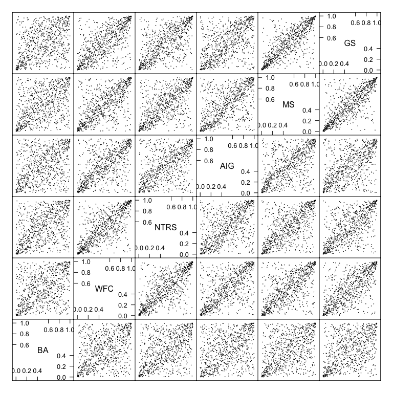

Figure (a): Pseudo observations (uniform margins) obtained from actual
data, with non parametric estimation of the CDFs.

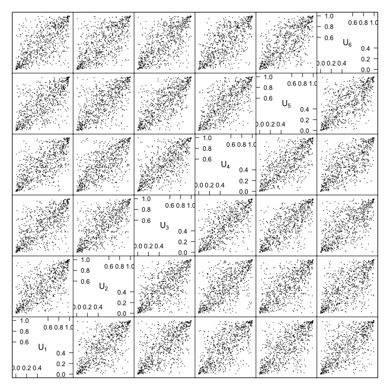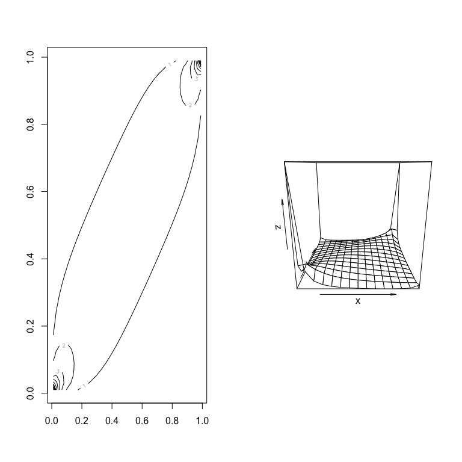

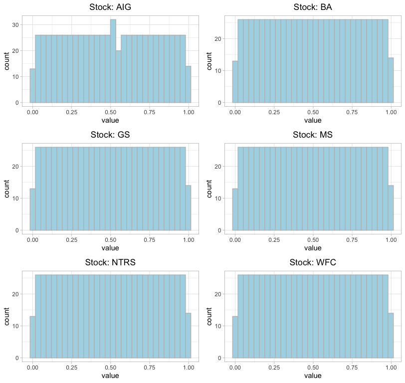

Figure: Pseudo-observations Distribution

## Portfolio Value-at-Risk

In this section we consider a linear portfolio which allocates $1000 on
each of the ten assets at the beginning of the period. We denote
") the vector of portfolio holdings at
the beginning of the period where *n* stands for units of asset *i*
bought at . We
assume that the holdings (units) remain constant over the entire period.
The following Equation represent the value of the portfolio at any time
time t which is the sum of each asset.   
  
The portfolio weights on asset *i* are   
  
When each  remain constant over time, then the portfolio weights changes
over time.

Once, we have the value of the portfolio at each time period the *profit
and loss* gives the change in value of the portfolio between two
consecutive times   
  
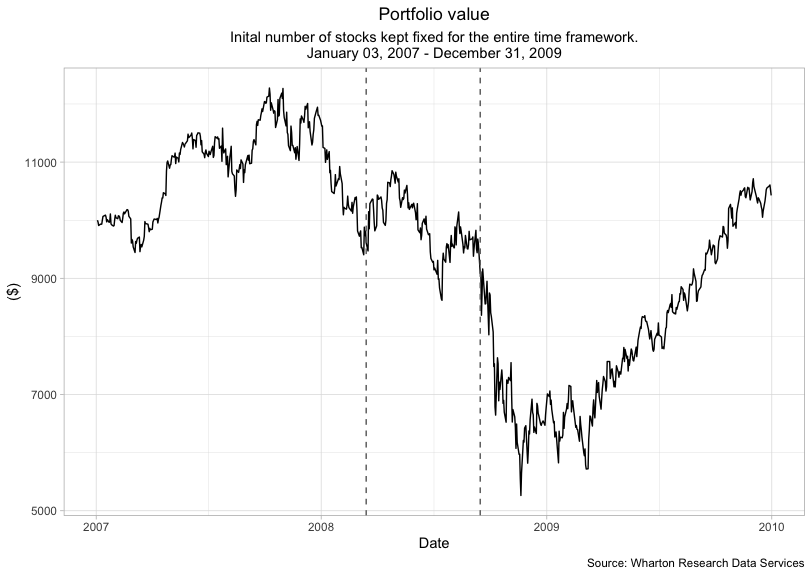
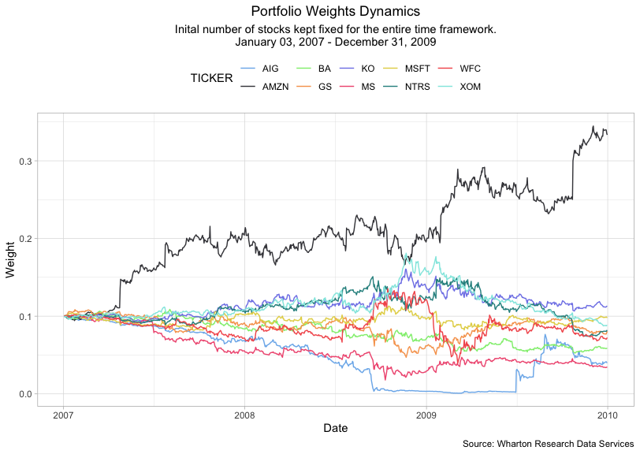

The box plot in the Figure below displays the historical distribution of
the losses obtained until 31 December 2009. Overall, assuming expected
returns equal to zero, seems to be a reasonable assumption.

The next step consists in computing the 95% Value-at-Risk for the
portfolio, over a risk horizon of one day.

Two strategies are adopted. Firstly, we assume that the percentage
returns of the portfolio are i.i.d. normally distributed. The resulting
VaR is expressed as a percentage of the portfolio’s current value, since
it is estimated from the portfolio return distribution. Secondly, I
adopt a non-parametric approach based on the 95-th quantile of the
empirical cdf. In this case, the advantage of adopting such approach
relies on the fact that no assumption are made on the functional form of
the model which generates the data. On the other hand, we are implicitly
assuming that empirical cdf estimated from past returns will be
representative for the returns one day ahead from now. Needless to say,
this assumption might not be correct. The difference between the two
approaches is illustrated in the following Figures.

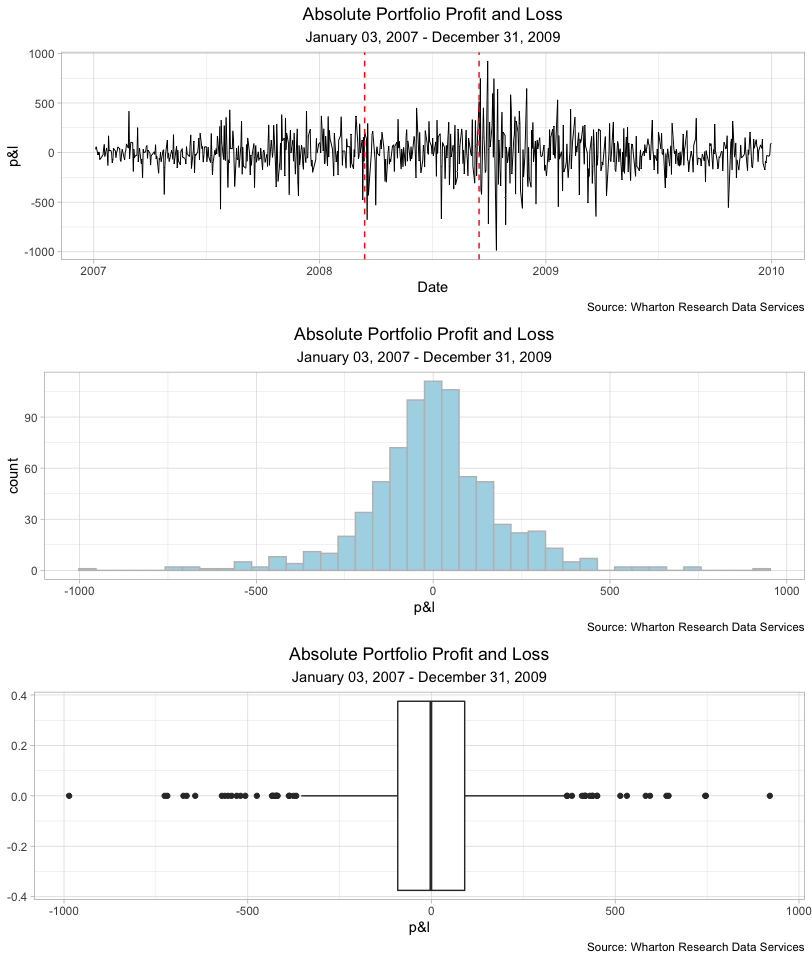

The VaR results should be interpreted as follows: (1) under the
parametric normal VaR, we expect to incur in a loss of more than $417.05
with probability 5%, over a one-day horizon; (2) under the historical
VaR, we expect to incur in a loss of more than $344.05 with probability
5%, over a one-day horizon. Hence, the parametric approach leads to more
cautious decisions in terms of capital management, because it signals
higher potential losses compared to the historical one.

<table>

<caption>

95% Value-at-Risk calculated on 31 December 209 for a one-day horizon
under parametric and non-parametric appproach.

</caption>

<thead>

<tr>

<th style="text-align:right;">

Gaussian VaR

</th>

<th style="text-align:right;">

Historical VaR

</th>

</tr>

</thead>

<tbody>

<tr>

<td style="text-align:right;">

0,0391

</td>

<td style="text-align:right;">

0,0346

</td>

</tr>

</tbody>

</table>

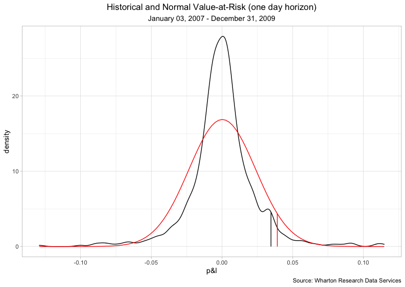

The last step of the VaR analysis consists in testing the two models on
portfolio returns of 2010 using a rolling window of 755 days. The first
step of the test compares the VaR forecast made on 31 December 2009,
with the realized loss/return obtained on 2 January 2010. In other
words, the realized loss/return on
 is compared
with the VaR predicted for that day in
. If the loss is higher
than the threshold signaled by the VaR, then a *violation* is recorded.
The procedure proceeds by shifting the estimation window ahead by one
day until exhaustion. In the end, we find that both the historical and
parametric VaR are almost constant during the period. This might be a
pitfall of this metric since it might not be flexible enough to changing
condition, especially in presence of higher volatility. The Figure below
shows in red the daily VaR and in black the actual loss/return. When the
red line intersects the black one we record a violation where the VaR
fails to predict the actual loss. Notice that losses are indicated as
positive quantities. In conclusion, Table below summarizes the number of
violations.

<table class="kable_wrapper">

<tbody>

<tr>

<td>

<table>

<caption>

Number violations for 2010 returns under Gaussian VaR

</caption>

<thead>

<tr>

<th style="text-align:left;">

Violation

</th>

<th style="text-align:right;">

n

</th>

</tr>

</thead>

<tbody>

<tr>

<td style="text-align:left;">

NO

</td>

<td style="text-align:right;">

250

</td>

</tr>

<tr>

<td style="text-align:left;">

YES

</td>

<td style="text-align:right;">

2

</td>

</tr>

</tbody>

</table>

</td>

<td>

<table>

<caption>

Number violations for 2010 returns under Historical VaR

</caption>

<thead>

<tr>

<th style="text-align:left;">

Violation

</th>

<th style="text-align:right;">

n

</th>

</tr>

</thead>

<tbody>

<tr>

<td style="text-align:left;">

NO

</td>

<td style="text-align:right;">

249

</td>

</tr>

<tr>

<td style="text-align:left;">

YES

</td>

<td style="text-align:right;">

3

</td>

</tr>

</tbody>

</table>

</td>

</tr>

</tbody>

</table>

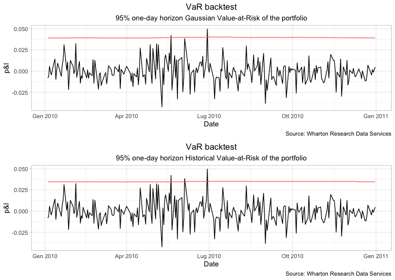

Embrechts, Paul, Alexander J. McNeil, and Rudiger Frey. 2015.
*Quantitative Risk Management: Concepts, Techniques and Tools*. Second.
Market Risk Analysis. Princeton University Press.

Ruppert, David. 2006. *Statistics and Finance*. Second. Springer.

